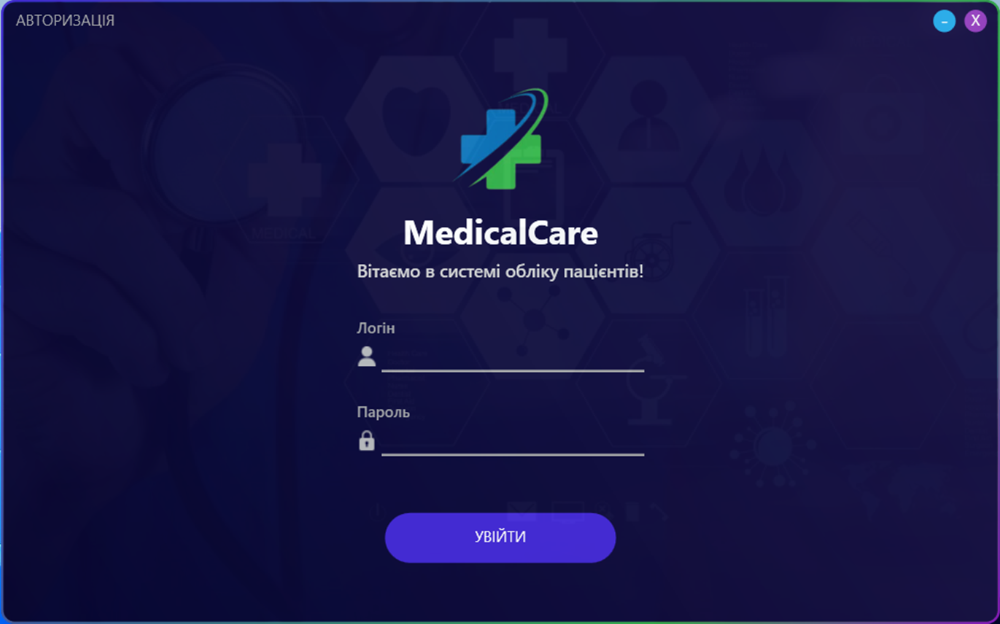
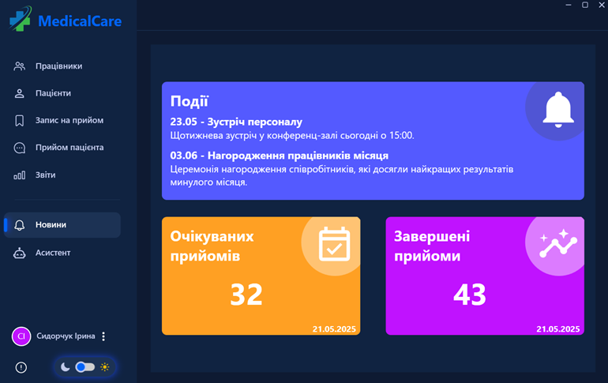
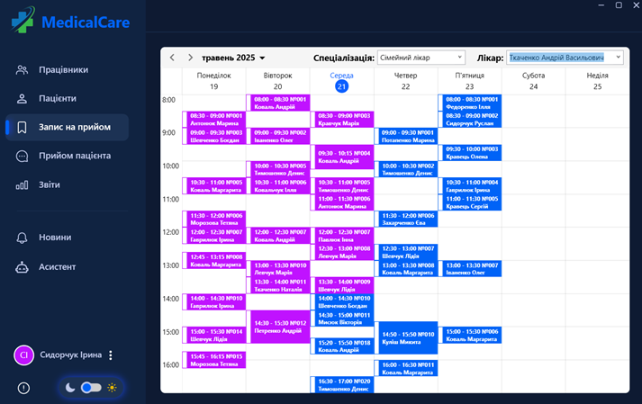
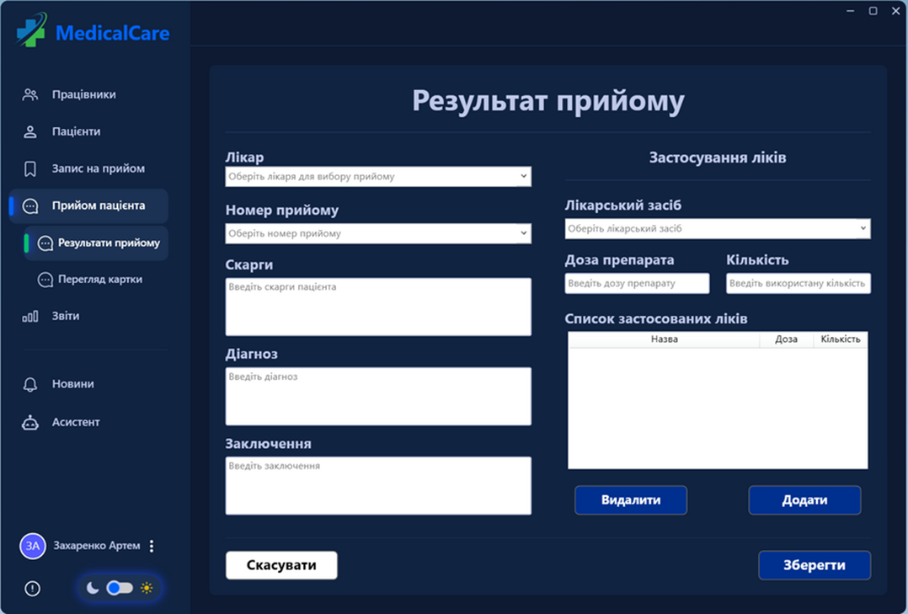
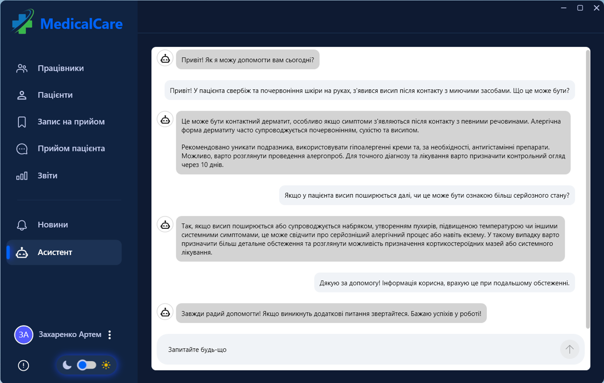

# MedicalCare 🏥

Desktop application developed in C# using Windows Presentation Foundation (WPF) to automate the workflow of a district polyclinic. It manages patients, records, and reports, and includes an AI assistant to support doctors. This system is designed to solve the problem of outdated or manual record-keeping and can operate effectively in environments with unstable or no internet access.

## ✨ Key Features

- **Full Patient Management**: Complete CRUD operations for patient records.
- **Staff & Schedule Management**: Manage staff profiles and doctor's appointment schedules.
- **Electronic Medical Records**: Detailed records for diagnoses, treatments, prescriptions, and patient history.
- **Role-Based Access Control**: Three distinct user roles with different permissions:
  - **Administrator**: Manages all staff accounts.
  - **Registry employee**: Manages patient data and schedules appointments.
  - **Doctor**: Accesses patient records, conducts appointments, and uses the AI assistant.
- **Offline AI Assistant**: An integrated chat assistant powered by a local LLaMA 3.1 model (via Ollama) to provide diagnostic support and information to doctors.
- **Reporting System**: Generate and export reports (e.g., appointments per period, medicines used) using Microsoft Report Viewer.
- **Appointment Reminders**: Automatically sends email reminders to patients.

## 🛠️ Tech Stack

- **Framework**: .NET Framework 4.7.2
- **Language**: C#
- **UI**: WPF (Windows Presentation Foundation)
- **Database**: MS SQL Server
- **Reporting**: Microsoft Report Viewer
- **Local AI**: LLaMA 3.1 (served via Ollama)

## 🚀 Getting Started

Follow these steps to set up and run the project locally.

### Prerequisites

- Visual Studio 2019 or 2022
- MS SQL Server
- SQL Server Management Studio (SSMS)
- Ollama (for the AI assistant)

### 1. Clone the Repository

```bash
git clone https://github.com/TStakhniuk/polyclinic-management-system.git
cd polyclinic-management-system
```

### 2. Database Setup

1. Open SQL Server Management Studio (SSMS) and connect to your local SQL Server instance.
2. In the repository, locate the `Database` folder.
3. Execute the SQL scripts found in this folder in the correct order ("Database.sql" first, then "Tables.sql", etc.). This will create the `DistrictPolyclinic` database, its tables, and all necessary objects.

### 3. AI Assistant Setup (Ollama)

This step is required for the "AI Assistant" feature to work.

1. Download and install [Ollama](https://ollama.ai/) on your machine.
2. Open your terminal (CMD or PowerShell).
3. Navigate to the `Chat` folder located within the `DistrictPolyclinic` project folder. You will find a `Modelfile` there.
4. Run the following command to create the local AI model from the Modelfile (which is based on LLaMA 3.1):

```bash
ollama create medical-assistant -f Modelfile
```

5. After the model is created, ensure the Ollama server is running. By default, it serves the API at `http://localhost:11434/`.

### 4. Configure Your Environment

The project uses an `App.config` file for all its credentials and connection strings.

1. In the root of the project (inside the `DistrictPolyclinic` folder), find the file `App.config.example`.
2. Create a copy of this file and rename it to `App.config`.
3. Open the new `App.config` file with a text editor and fill in your values for the following keys:

```xml
<?xml version="1.0" encoding="utf-8"?>
<configuration>
    ...
    <appSettings>
        <add key="ApiBaseUrl" value="http://localhost:11434/" /> 

        <add key="SmtpHost" value="smtp.your-provider.com" />
        <add key="SmtpPort" value="587" />
        <add key="SmtpUser" value="your-email@example.com" />
        <add key="SmtpPassword" value="YOUR_EMAIL_APP_PASSWORD" />
    </appSettings>
    <connectionStrings>
        <add name="DistrictPolyclinic.Properties.Settings.DistrictPolyclinicConnectionString"
             connectionString="Data Source=localhost;Initial Catalog=DistrictPolyclinic;User ID=YOUR_DB_USER;Password=YOUR_DB_PASSWORD;TrustServerCertificate=True"
             providerName="System.Data.SqlClient" />
    </connectionStrings>
    ...
</configuration>
```

**Key fields to change:**

- `ApiBaseUrl`: The URL to your local Ollama server (default is `http://localhost:11434/`).
- `SmtpHost`, `SmtpPort`, `SmtpUser`, `SmtpPassword`: Your email credentials. (For Gmail, you'll need to generate an "App Password").
- `connectionString`: Your `User ID` and `Password` for SQL Server.

### 5. Run the Application

1. Open the `DistrictPolyclinic.sln` file in Visual Studio.
2. Wait for Visual Studio to restore all NuGet packages.
3. Press the "Start" button to build and run the project.

## 🖼️ Screenshots
Here is a brief overview of the application's interface.

### 1. Login Screen
Role-based authorization window for all users.


### 2. Main Menu (Dashboard)
The main dashboard for employees, showing key statistics, news, and events.


### 3. Appointment Schedule
The interactive appointment calendar allows registry employees to view schedules by specialization or doctor and book new appointments.


### 4. Appointment Results Form (Doctor's View)
The form doctors use to fill in appointment results, including patient complaints, diagnosis, conclusions, and prescribed medications.


### 5. AI Assistant Chat
The integrated AI assistant that helps doctors with diagnostic suggestions based on symptoms.


## 🧑‍⚕️ User Roles & Functionality

The system provides three distinct roles to ensure data security and proper workflow.

### 1. Administrator (Head of HR)

- **Staff Management**: Full CRUD operations for all staff accounts.
- **Access Control**: Assigns roles and credentials to new employees.
- **Data Overview**: Can view all system data.

### 2. Registry employee

- **Patient Management**: Registers new patients, edits existing patient information, and manages electronic medical cards.
- **Appointment Scheduling**: Books, modifies, and cancels appointments for all doctors.
- **View Schedules**: Can see the complete schedule for all doctors to find available slots.

### 3. Doctor

- **View Personal Schedule**: Sees a list of their own appointments for the day.
- **Access Patient History**: Can open and review the full medical history of a patient during an appointment.
- **Update Medical Records**: Fills in appointment results, diagnoses, and prescriptions.
- **Use AI Assistant**: Can open the chat interface to get diagnostic suggestions or information based on symptoms.
- **Generate Reports**: Can create and export reports.